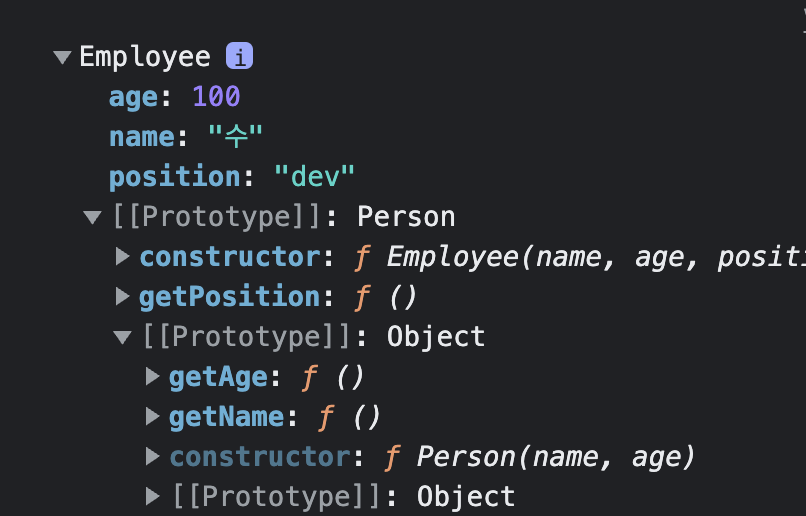

# Core-JS study

## Class

</br>

- 목차

1. Class  
   1-1. Class 의 의미와 용어 정리  
   1-2. Class 의 실제 활용 사례  
   1-3. Class 정리
2. Class Inheritance (클래스 상속)  
   2-1. Class 상속 구조 만드는 과정

</br>
</br>
</br>

## 1. Class

</br>
</br>
</br>

## 1-1. Class 의 의미와 용어 정리

</br>
</br>
</br>

`Class` 는 사전적 의미로는 계급, 집단, 집합이라고 풀이되는데

</br>

이를 풀어서 해석하면 `공통적인 속성`을 모아 `한데 묶은 덩어리` 또는 `명세` 라고 할 수 있다.

</br>

또한 클래스와 함께 등장하는 용어로 `인스턴스` 가 있는데

</br>

`인스턴스`는 해당 클래스의 속성을 지닌 구체적인 객체들이다.

</br>

예를 들어 귤, 바나나, 사과, 오렌지, 배 등은 `인스턴스`이며 과일은 `클래스` 이다.

</br>

또한 과일은 음식이라고 하는 큰 범주에 속하기 때문에 과일은 음식보다 하위 클래스에 속하게 된다.

</br>

그런데 귤, 바나나, 사과, 오렌지, 배 등은 직접 볼 수도, 먹을 수도 있는 `구체적인 개념`이고

</br>

과일이나 음식 등은 `추상적인 개념`이다.

</br>

이처럼 어떤 공통된 특성을 지니는 구체적인 대상들을 `인스턴스` 라고 하고

</br>

인스턴스들의 공통 속성을 모은 추상적인 개념이 곧 `클래스` 이다.

</br>
</br>

하지만 `프로그래밍 언어`에서는 `상위의 클래스`가 `먼저 정의` 되어야 하위 클래스 및 인스턴스를 생성할 수 있다.

</br>

즉, 음식 클래스가 먼저 정의 되어야 음식 클래스의 속성을 지니면서 그 중에서 좀 더 구체적인 특성을 지니는 하위 클래스인 과일 클래스를 정의할 수 있다.

</br>

과일 클래스가 정의 되면 귤, 바나나, 사과, 오렌지, 배 등의 구체적인 객체들이 음식이기도 하면서 과일인 인스턴스가 될 수 있다.

</br>

음식 클래스는 과일 클래스에게 상위 클래스 (superclass) 이다.

</br>

반면 과일 클래스는 음식 클래스에게 하위 클래스 (subclass) 이다.

</br>
</br>
</br>

## 1-2. Class 의 실제 활용 사례

</br>
</br>
</br>

우리가 배열 리터럴을 생성할 때 Array 라는 생성자 함수를 new 연산자와 함께 호출한 결과와 같다고 알고 있다.

</br>

그 중 배열 리터럴이 아닌 `Array 생성자 함수 부분`만 분리해서 본다면 그 부분이 바로 일반적인 개념상의 `클래스` 역할을 담당한다.

</br>

왜냐하면 `Array 생성자 함수`는 그 자체로 어떤 역할을 수행한다기 보다 주로 `new 연산자`를 통해 `생성한 배열 객체들의 기능`을 `정의`하는 데에 주력하고 있기 때문이다.

</br>

그런가 하면, `클래스를 통해 생성한 객체` 즉, `배열 객체`를 `인스턴스`라고 한다.

</br>

`구체적인 데이터`를 가지고 `실제 코드 상`에서 `동작`을 `수행`하는 실체 중 하나이다.

</br>


출처 - 인프런 코어자바스크립트

</br>
</br>

이 중에서 Class 파트만 떼어 놓고 본다면 prototype 프로퍼티 내부에 할당되지 않고 `Array 생성자함수 객체`에 `직접 할당`되어 있는 `프로퍼티들(isArray, of, arguments 등)` 을 `static methods`, `static property`라고 한다.

</br>

이들은 `Array 생성자 함수`를 new 연산자 없이 `함수(객체)`로써 `호출`할 때에만 의미가 있는 값들이다.

</br>

보통 `해당 클래스 소속`의 `인스턴스들`의 개별적인 동작이 아닌 `소속 여부 확인, 소속 부여` 등의 `공동체적인 판단`을 `필요로 하는 경우`에 `스테틱 메서드`를 `활용`하곤 한다.

</br>

한편 `prototype 내부에 정의된 메서드`들은 prototype 을 생략하고 `메서드`라고 하는 경우가 많다.

</br>

클래스와 인스턴스 관계를 살펴본다면 `스테틱한 값`들은 클래스 왼쪽에, 그리고 `프로토타입 메서드`는 클래스 오른쪽에 두었을 때 `인스턴스로부터 직접 접근`이 `가능`한지 `여부`가 서로 `다르다`.

</br>

`프로토타입 프로퍼티`는 인스턴스와 [[Prototype]] 으로 연결되어 있고 [[Prototype]] 가 인스턴스와 겹쳐서 동작하기 때문에 `인스턴스`에서 직접 `프로토타입 메서드`에 `접근 가능`한 반면,

</br>

`생성자 함수 내부`에 있는 `프로퍼티나 메소드(스테틱)` 는 직접 `접근할 방법이 없다`.

</br>
</br>

구체적인 코드를 통해 살펴본다.

</br>

```js
function Person(name, age) {
  this._name = name;
  this._age = age;
}

Person.getInformations = function (instance) {
  return {
    name: instance._name,
    age: instance._age,
  };
};

Person.prototype.getName = function () {
  return this._name;
};

Person.prototype.getAge = function () {
  return this._age;
};
```

</br>

      이 중에서 Person.getInformations 는 static method

      나머지 Person.prototype.getName 와 Person.prototype.getAge 는 프로토타입 메서드

</br>

sue 라는 Person 의 인스턴스를 생성한다.

```js
var sue = new Person("수", 100);

console.log(sue.getName()); // 출력 ok
console.log(sue.getAge()); // 출력 ok

console.log(sue.getInformations(sue)); // Error
console.log(Person.getInformations(sue)); // 출력 ok
```

</br>

      프로토타입 체이닝은 대각선으로만 검색하기 때문에 스테틱 메서드에서 제대로 된 결과를 얻기 위해서는 인스턴스가 아닌 생성자 함수에서 직접 접근해야 제대로 된 결과를 얻을 수 있음

</br>
</br>
</br>

## 1-3. Class 정리

</br>
</br>
</br>


출처 - 인프런 코어자바스크립트

</br>

`클래스`는 `어떤 공통된 속성`이나 `기능`을 `정의`한 `추상적인 개념`이고,

</br>

이 `클래스에 속한 객체`를 `인스턴스`라고 한다.

</br>

`클래스`에는 인스턴스에서 직접 접근할 수 없는 `클래스 자체에서만 접근 가능`한 `스테틱 메소드, 프로퍼티`가 있으며,

</br>

`인스턴스에서 직접 활용`할 수 있는 `프로토타입 메서드`가 있다.

</br>
</br>
</br>

## 2. Class Inheritance (클래스 상속)

</br>
</br>
</br>


출처 - 인프런 코어자바스크립트

</br>

Person 이라고 하는 클래스에는 name, age 프로퍼티가 있고, getName 과 getAge 라는 메서드를 사용할 수 있다고 친다.

</br>

한편 Employee 라는 클래스에는 name, age, position 프로퍼티가 있고, getName, getAge, getPosition 이라는 메서드를 사용할 수 있다고 친다.

</br>

그런데 겹치는 메서드가 보인다. 그림 상으로는 프로퍼티에 있는 getName, getAge 가 겹친다.

</br>

이를 Person 클래스가 Employee 상위에 있는 구조로 만들어주면 해결 될 것이다.

</br>

겹치는 메서드는 상위인 Person 에만 두고 Employee 에는 겹치지 않는 메서드를 둔다.

</br>

그렇게 만든 Employee 의 인스턴스는 프로토타입 체이닝을 타고 Employee 의 getPosition 메서드 뿐만 아니라 Person 의 getName, getAge 메서드도 사용할 수 있게 된다.

</br>


출처 - 인프런 코어자바스크립트

</br>

그렇다면 이러한 다중 상속 구조는 어떻게 만드는 지 알아본다.

</br>
</br>
</br>

## 2-1. Class 상속 구조 만드는 과정

</br>
</br>
</br>

그림을 상상해 본다면 Employee 의 오른쪽 꼭짓점과 Person 의 아랫쪽 꼭짓점을 연결하면 된다.

</br>

그것을 코드로 표현한다면 `Employee.prototype = new Person()` 이다.

</br>

`Employee 의 prototype` 에 `새로운 Person 인스턴스`를 `연결`하면 된다.

</br>

하지만 위의 코드로는 Employee.prototype 를 새로운 객체로 대신하는 결과가 나오기 때문에 기존의 프로토타입과 동일하게 동작하도록 해주기 위해서는 본래 갖고 있던 기능을 다시 부여해줄 필요가 있다.

</br>

`프로토타입의 constructor` 를 `Employee 로 지정`해주는 과정이 필요하다.

</br>

`Employee.prototype.constructor = Employee`

</br>

이렇게 하면 서로 다른 클래스가 슈퍼 클래스, 서브 클래스 구조를 갖게 된다.

</br>

위의 구조를 코드를 통해 살펴본다.

</br>

```js
function Person(name, age) {
  this.name = name || "이름없음";
  this.age = age || "나이모름";
}

Person.prototype.getName = function () {
  return this.name;
};

Person.prototype.getAge = function () {
  return this.age;
};

function Employee(name, age, position) {
  this.name = name || "이름없음";
  this.age = age || "나이모름";
  this.position = position || "직책모름";
}
```

</br>

이 상태에서 앞서 봤던 내용들을 구현해본다.

</br>

```js
Employee.prototype = new Person();
Employee.prototype.constructor = Employee;
Employee.prototype.getPosition = function () {
  return this.position;
};
```

    맨 아래줄 코드가 아래에 있는 이유는

    맨 위의 Employee.prototype = new Person(); 코드보다

    먼저 상위에서 프로토타입에 어떤 프로퍼티나 메서드를 정의해봤자

    Employee.prototype 참조를 새로운 객체인 new Person 인스턴스로 바꿔치울 것이기 때문에 의미 없게 됨

    따라서 프로토타입을 덮어 씌운 다음에 정의를 할 수 밖에 없음

</br>

위와 같은 상태에서 Employee 의 인스턴스를 생성하고 내용을 출력하면 아래와 같다.

</br>

```js
var sue = new Employee("수", 100, "dev");
console.dir(sue);
```

</br>


    sue 라는 객체 자신이 갖는 프로퍼티

    sue 객체는 Employee 에 new 연산자를 통해 생성한 Employee 인스턴스

</br>


    sue 의 [[Prototype]] 영역

    Employee 의 prototype 과 같음

    또한 상속 관계를 부여하는 가장 핵심 포인트였던

    Employee.prototype = new Person() 을 떠올려보면 곧 Person 의 인스턴스임을 알 수 있음

    그래서 age, name 프로퍼티가 보임

    constructor 로는 우리가 부여해준 Employee 가 확인됨

    Employee 인스턴스가 사용할 getPosition 도 보임

</br>


    sue.__proto__ 에 다시 __proto__ 를 찾아간,

    프로토타입 체이닝을 두 번 건너 뛴 내용

    Person 의 프로토타입

    따라서 constructor 가 Person 생성자 함수를 가리키고 있음

    마지막 줄 [[Prototype]] 에는 Object 가 표시되어 있는데 사실 Object.prototype 을 가리킴

    즉, Person.prototype 은 Object 의 인스턴스가 되는 것임

</br>

문제가 되는 부분이 있다.


    위와 같은 정보가 추상적이어야 할 클래스의 프로토타입에 담겨 있는 것이 바람직하지 않음

    만약 실수로 sue 객체에서 name 프로퍼티를 지워버린 상태에서

    getName 메서드를 호출한다면

    원래대로라면 undefined 가 반환되어야 할 상황인데

    실제로는 프로토타입 체이닝을 타고 '이름없음' 이라는 엉뚱한 결과가 반환될 것


    프로토타입 체이닝 상에는 프로퍼티가 아닌 메소드들만 존재 하게끔 하는 것이 '추상적인 클래스' 라고 하는 정의에 부합할 것임

    name: '이름없음', age: '나이모름' 을 지워버리고 싶음


    생각해보면 각 클래스의 프로토타입을 [[Prototype]] 로 내려 받는 무언가가 필요한 것이지,

    반드시 Person 의 인스턴스가 필요한 것이 아님

    즉, Person.prototype 을 상속 받는 별도의 인스턴스가 있고

    그 객체에는 아무런 프로퍼티도 존재하지 않으면 됨

</br>

예를 들어 비어 있는 Bridge 생성자 함수를 만든다고 친다. (Employee 와 Person 생성자 함수 간을 연결한다는 의미로 Bridge 라고 칭함)

</br>

Bridge 의 prototype 에 Person prototype 을 연결한 상태에서 인스턴스를 생성하면

</br>

해당 인스턴스에는 아무런 프로퍼티가 없이 메서드만 상속받는 형태가 된다.

</br>

그 상태에서 Employee 의 prototype 과 Bridge 의 인스턴스를 연결하는 구조로 만들어보도록 한다.

</br>

위의 구조를 코드를 통해 살펴본다.

</br>

```js
function Person(name, age) {
  this.name = name || "이름없음";
  this.age = age || "나이모름";
}

Person.prototype.getName = function () {
  return this.name;
};

Person.prototype.getAge = function () {
  return this.age;
};

function Employee(name, age, position) {
  this.name = name || "이름없음";
  this.age = age || "나이모름";
  this.position = position || "직책모름";
}
```

</br>

위의 코드 내용은 같으나 아래 코드 부분이 달라지게 된다.

</br>

```js
function Bridge() {}
Bridge.prototype = Person.prototype;
Employee.prototype = new Bridge();
Employee.prototype.constructor = Employee;

Employee.prototype.getPosition = function () {
  return this.position;
};
```

```js
var sue = new Employee("수", 100, "dev");
console.dir(sue);
```

</br>

이 상태로 인스턴스를 생성하면 아래와 같이 깔끔한 결과가 나온다.

</br>



</br>

Bridge 라는 생성자 함수 매개체를 이용해서 Person 의 인스턴스와의 연결 관계를 끊음으로써

</br>

프로퍼티 체인 상에 불필요한 프로퍼티 (e.g. - name, age) 가 생성되지 않게 된 것이다.

</br>

## However

</br>

이 기능은 ES5 시스템에서 클래스 상속을 구현하는데에 상당히 자주 등장하는 패턴이거니와

Bridge 라는 함수는 매개체 역할만 할 뿐 실제 코드 상에 영향을 주는 함수가 아니기에

더글라스 크락포드 라는 분께서는 아래와 같이 함수화 시켜서 활용할 것을 추천하고 있다.

</br>

```js
var extendClass = (function () {
  function Bridge() {}
  return function (Parent, Child) {
    Bridge.prototype = Parent.prototype;
    Child.prototype = new Bridge();
    Child.prototype.constructor = Child;
  };
})();
```

클로저를 이용하여 `(function () {`, `return`, `})();`

</br>

Bridge 생성자 함수는 단 한 번만 생성하고 계속 재활용을 하고, `function Bridge() {}`

</br>

super 와 sub 클래스로 쓰일 생성자 함수를 매개변수로 넘겨주면 `Parent`, `Child`

</br>

자동으로 둘 사이의 상속 구조를 연결해주는 함수이다.

</br>

이를 활용하면 아래와 같이 보다 간단한 형태로 상속을 구현할 수 있다.

</br>

```js
var extendClass = (function () {
  function Bridge() {}
  return function (Parent, Child) {
    Bridge.prototype = Parent.prototype;
    Child.prototype = new Bridge();
    Child.prototype.constructor = Child;
  };
})();

extendClass(Person, Employee);

Employee.prototype.getPosition = function () {
  return this.position;
};

var sue = new Employee("수", 100, "dev");
console.dir(sue);
```

</br>

extendClass 라는 함수는 전체 자바스크립트 코드상에 단 한 번만 구현해두면 되며,

</br>

이후로는 복잡한 과정을 매번 떠올릴 필요 없이 extendClass 라는 함수를 호출해주기만 하면 된다.

</br>

그리고 지금까지는 메서드만 살펴보았지만 인스턴스의 value 들 역시 상속 구조를 구현하면 간단한 구현이 가능하다.

</br>

Person 의 인스턴스와 Employee 의 인스턴스 모두 name, age 라는 똑같은 프로퍼티를 가지는데

</br>

하위 클래스에서 아래와 같이 변경해주면 더욱 편리하게 name, age 프로퍼티를 구현할 수 있으면 편할 것이다.

</br>

```js
function Person(name, age) {
  this.name = name || "이름없음";
  this.age = age || "나이모름";
}

Person.prototype.getName = function () {
  return this.name;
};

Person.prototype.getAge = function () {
  return this.age;
};

function Employee(name, age, position) {
  this.superClass(name, age); // 변경
  this.position = position || "직책모름";
}
```

    this.superClass(name, age) 에서

    생성자 함수 this 는 아래 코드에서 볼 수 있는 sue 라는 Employee 라는 인스턴스를 가리킴

    해당 인스턴스(sue)에는 'superClass' 라고 하는 메서드가 없으니

    프로토타입 체이닝을 타고 Employee.prototype 내부에서

    'superClass' 메서드를 검색할 것이며 존재하니 해당 메서드를 실행할 것

    'superClass' 메서드에는 Parent, 즉 Person 이 연결 되어 있으니

    Person 생성자 함수가 호출됨

    이 때 this.superClass(name, age); 를 호출한 것이기에 메서드(. 앞)로써 호출될 것임

    superClass 앞의 this 즉, 원래의 this 인 Employee 인스턴스인 sue 가 그대로 this 가 됨


    따라서 this.superClass 메서드를 호출하면

    Employee 의 인스턴스인 name 프로퍼티, age 프로퍼티에 각각 값을 할당하라는 명령이 됨

</br>

```js
var extendClass = (function () {
  function Bridge() {}
  return function (Parent, Child) {
    Bridge.prototype = Parent.prototype;
    Child.prototype = new Bridge();
    Child.prototype.constructor = Child;
    Child.prototype.superClass = Parent; // 코드 추가
  };
})();

extendClass(Person, Employee);

Employee.prototype.getPosition = function () {
  return this.position;
};

var sue = new Employee("수", 100, "dev");
console.dir(sue);
```

</br>
</br>

최종적으로 코드를 정리하면 아래와 같다.

</br>

```js
var extendClass = (function () {
  function Bridge() {}
  return function (Parent, Child) {
    Bridge.prototype = Parent.prototype;
    Child.prototype = new Bridge();
    Child.prototype.constructor = Child;
    Child.prototype.superClass = Parent;
  };
})();

function Person(name, age) {
  this.name = name || "이름없음";
  this.age = age || "나이모름";
}

Person.prototype.getName = function () {
  return this.name;
};

Person.prototype.getAge = function () {
  return this.age;
};

function Employee(name, age, position) {
  this.superClass(name, age);
  this.position = position || "직책모름";
}
extendClass(Person, Employee);

Employee.prototype.getPosition = function () {
  return this.position;
};
```

    클래스 상속을 구현하기 위한 extendClass 함수는 위쪽에 정의되어 있고,

    실제 superclass 와 subclass 의 구체적인 내용을 아래 부분에서 적어 놓음

</br>

또한 위의 코드에서 지금까지 배운 모든 내용이 다 스며들어 있다.

</br>

a) 참조형 데이터가 정보를 저장하는 법

b) 참조형 데이터를 저장했던 변수에 다른 데이터를 할당하는 것에 따른 결과

c) 스코프, 실행컨텍스트

d) this 바인딩

e) 클로저의 원리

f) 프로토타입과 프로토타입 체이닝 등등

</br>
</br>

그런데 위의 코드 또한 ECMAScript6 가 나온 후에는 더욱 간단하게 작성할 수 있다.

</br>

ES6 에서는 extendClass 라는 함수를 직접 만들어서 구현하지 않아도

</br>

자바스크립트 내장 명령으로 손쉽게 클래스 상속을 구현할 수 있다.

</br>

class Person 을 만들고, Employee 는 Person 을 extends 해주기만 하면 된다.

</br>

```js
class Person {
  constructor(name, age) {
    this.name = name || "이름없음";
    this.age = age || "나이모름";
  }
  getName() {
    return this.name;
  }
  getAge() {
    return this.age;
  }
}

class Employee extends Person {
  constructor(name, age, position) {
    super(name, age);
    this.position = position || "직책모름";
  }
  getPosition() {
    return this.position;
  }
}
```
