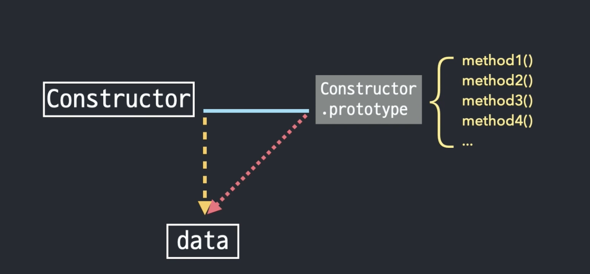

# Core-JS study

## Prototype

</br>

- 목차

1. Prototype  
   1-1. Prototype 의 기본 개념 용어와 예시  
   1-2. Prototype 실행 원리 정리  
   1-3. 인스턴스에서 prototype 에 접근하는 방법
2. 메소드 상속 및 동작 원리
3. Prototype Chaining
4. 프로토타입 정리

</br>
</br>
</br>

## 1. Prototype

</br>
</br>
</br>

## 1-1. Prototype 의 기본 개념 용어와 예시

</br>
</br>
</br>


출처 - 인프런 코어자바스크립트

</br>

    Constructor 는 생성자

    그 오른쪽은 prototype

    그 아래는 instance

</br>

Constructor.prototype 과 instance[[Prototype]] 가 같은 객체를 바라본다는 뜻이다.

</br>

그런데 [[Prototype]] 는 접근 가능한 것이 아니라 정보를 보여주기만 할 뿐 (console 에서만 표시되는 내용, prototype 에 직접 접근 불가)으로,

</br>

실제 동작상으로는 instance 와 동일시 되어 생각하면 된다.

</br>


출처 - 인프런 코어자바스크립트

</br>
</br>

이를 설명하기 위해 배열의 예시를 가져온다.

</br>

[1, 2, 3] 이라는 요소를 가진 배열이 있다.

</br>

생성자로 생성한 경우 생성자 함수는 Array 가 된다.

</br>

Array 라고 하는 함수에는

    from()
    isArray()
    of()
    arguments
    length
    name
    prototype

등의 프로퍼티들이 있다.

</br>

크롬 개발자 도구에서 Array 생성자 함수를 호출하면 아래와 같다.


</br>

여기서 prototype 이라고 하는 프로퍼티가 있다.

</br>

이것이 [1, 2, 3] 배열 리터럴의 [[Prototype]] 으로 연결되어 있는 것이다.

</br>

prototype 이라고 하는 프로퍼티는 객체인데 이 객체에는 아래와 같은 프로퍼티들이 담겨 있다.


</br>

    concat()
    filter()
    forEach()
    map()
    push()
    pop()

등 배열 메서드들이 여기에 담겨 있다.

</br>
</br>

이번에는 배열 인스턴스를 출력해본다.

</br>


</br>

여기서 [[prototype]] 을 열어본다면 아래와 같이 메서드 리스트가 나온다.

</br>


</br>

위의 Array.prototype 과 내용이 같은 것을 확인할 수 있으며 같은 객체라는 것이 확인된다.

</br>

이 중 prototype 에 있는 constructor 라는 프로퍼티가 보이는데 여기에 Array() 함수가 담겨 있다.


</br>

Array.prototype.constructor 는 Array() 자기 자신 즉, Array 생성자 함수 자기 자신을 가리킨다.


</br>

배열.constructor 역시 Array 생성자 함수 자기 자신을 가리킨다.

</br>


</br>

    [1, 2, 3].constructor 로 접근하려고 하면

    [1, 2, 3].[[prototype]].constructor 요청과 동일하게 인식 (실제로 이런 방식으로 접근할 수 있는 것은 아님)

    이는 곧 Array.prototype.constructor 와 동일하다고 간주하게 됨

    그리고 이들은 결국 Array() 생성자 함수를 가리키게 됨

    => 결론적으로 내부적으로 이들이 모두 같음

</br>
</br>

한편 숫자 리터럴이 있다.

</br>

숫자 리터럴은 자체가 객체가 아니기 때문에 (기본형 데이터 타입) [[prototype]] 프로퍼티가 있을 수 없다.

</br>

그래도 개발자가 숫자 리터럴을 인스턴스인 것처럼 사용하려고 한다면 즉, 메서드(i.g - .toFixed())를 사용하려고 한다면

</br>

자바스크립트가 임시로 숫자 리터럴에 해당하는 Number 생성자 함수 인스턴스(Number.prototype)를 만든다.

</br>

그리고 해당 프로토타입에 있는 메서드를 적용해서 원하는 결과를 얻게 한다.

</br>

그 다음 다시 인스턴스를 제거하는 식으로 동작한다.

</br>

문자열 리터럴도 마찬가지이다.

</br>

기본형 데이터 타입은 모두 이 같은 방식으로 메서드를 호출할 수 있게 된다.

</br>

한편, 참조형 데이터 타입은 처음부터 인스턴스이기 때문에 기본형 데이터 타입처럼 메서드를 호출하는 순간 인스턴스를 임시 생성했다가 폐기하는 그런 과정을 거치지 않는다.

</br>

어쨌든 숫자든, 문자열이든, 함수든 할 것 없이 모두 아래와 같은 구조를 가지게 된다는 것이다.

</br>
</br>
</br>

## 1-2. Prototype 실행 원리 정리

</br>
</br>
</br>


출처 - 인프런 코어자바스크립트

</br>

Data 자신에게는 메서드가 없지만 생성자 함수의 prototype 프로퍼티에 있는 메서드를 [[prototype]] 이라는 연결 통로를 통하여 마치 자신의 것처럼 사용할 수 있다는 것이다.

</br>

null 과 undefined 를 제외한 모든 데이터 타입에는 이와 같은 생성자 함수가 존재한다.

</br>

또한 각 생성자함수 프로토타입에는 각 데이터 타입에만 해당하는 전용 메서드들이 정의되어 있다는 것이다.

</br>
</br>
</br>

## 1-3. 인스턴스에서 prototype 에 접근하는 방법

</br>
</br>
</br>

그렇다면 인스턴스에서 직접 prototype 에 접근할 수 있는 방법을 살펴본다.

</br>


출처 - 인프런 코어자바스크립트

</br>

    접근 방법 (2)

    1. instance.__proto__
      > console 에 보이지는 않지만 접근 가능
      > but, ES2015 에서 기존 브라우저에서 마음대로 제공하던 기능을 호환성 차원에서 문서화 해준 것이기 때문에
      가급적이면 공식적인 방법인 아래 2번 메서드를 사용하는 것이 나음

    2. Object.getPrototypeOf(instance)

</br>

예시는 아래와 같다.

</br>

```js
function Person(n, a) {
  this.name = n;
  this.age = a;
}

var sue = new Person("수", 100);

var sueClone1 = new sue.__proto__.constructor("수_클론1", 100);

var sueClone2 = new sue.constructor("수_클론2", 100);

var sueClone3 = new Object.getPrototypeOf(sue).constructor("수_클론3", 100);

var sueClone4 = new Person.prototype.constructor("수_클론4", 100);
```

</br>

    sue 와 sueClone1, 2, 3, 4 는 모두 Person 의 인스턴스가 됨

    <프로퍼티 접근 방식>

    모두 동일한 프로퍼티에 접근할 수 있음

    a) sueClone1 - sue.__proto__ 에 의해 Person.prototype 에 접근 가능
    b) sueClone2 - sue 의 [[prototype]] 프로퍼티에 의해서 Person.prototype 에 접근 가능
    c) sueClone3 - Object.getPrototypeOf(instance) 메서드에 의해 Person.prototype 에 접근 가능
    d) sueClone4 - Person.prototype 자체가 Person.prototype

    모두 Person.prototype 을 가리키고 있음

    - 정리

    a) instance.__proto__
    b) instance
    c) Object.getPrototypeOf(instance)
    d) Constructor.prototype

    위의 4가지 방법에 의해 생성자 함수의 prototype 이라고 하는 프로퍼티에 접근 가능

</br>

    <생성자 함수 접근 방식>

    또한 아래는 동일한 함수 Person 이라고 하는 생성자 함수를 가리킴

    아래의 5가지 방식으로 생성자 함수에 접근

    a) sue - Person
    b) sueClone1 - sue.__proto__.constructor
    c) sueClone2 - sue.constructor
    d) sueClone3 - Object.getPrototypeOf(sue).constructor
    e) sueClone4 - Person.prototype.constructor

    - 정리

    a) Constructor
    b) instance.__proto__.constructor
    c) instance.constructor
    d) (Object.getPrototypeOf(instance)).constructor
    e) Constructor.prototype.constructor

</br>
</br>
</br>

## 2. 메소드 상속 및 동작 원리

</br>
</br>
</br>

```js
function Person(n, a) {
  this.name = n;
  this.age = a;
}

var sue = new Person("수", 100);
var suri = new Person("수리", 88);
```

</br>

    Person 생성자로부터 sue 객체, 그리고 suri 라고 하는 객체 두개의 인스턴스 생성

</br>

```js
sue.setOlder = function () {
  this.age += 1;
};
sue.getAge = function () {
  return this.age;
};
suri.setOlder = function () {
  this.age += 1;
};
suri.getAge = function () {
  return this.age;
};
```

    각각에 setOlder, getAge 라는 메서드 생성

    근데 sue 와 suri 에 있는 setOlder, getAge 메서드가 모두 동일한 내용으로 이루어져 있음

</br>

## 이런 경우 최대한 반복을 줄여라! DRY (Don't Repeat Yourself) 해라!

</br>

```js
function Person(n, a) {
  this.name = n;
  this.age = a;
}

Person.prototype.setOlder = function () {
  this.age += 1;
};

Person.prototype.getAge = function () {
  return this.age;
};

var sue = new Person("수", 100);
var suri = new Person("수리", 88);
```

    프로토타입으로 메서드(setOlder, getAge)를 이동시킴

    이러한 방법의 장점으로는 아래와 같다.

    Person --- setOlder() , getAge()

```js
var sue = new Person("수", 100);

//

sue.setOlder();
sue.getAge();
```

    sue {
      name: '수',
      age: 100
    }

    //

    sue {
      name: '수',
      age: 101
    }

```js
var suri = new Person("수리", 88);

//

suri.setOlder();
suri.setOlder();
suri.getAge();
```

    suri {
      name: '수리',
      age: 88
    }

    //

    suri {
      name: '수리',
      age: 90
    }

```js
var juni = new Person("주니", 50);

//

juni.setOlder();
juni.setOlder();
juni.setOlder();
juni.getAge();
```

    juni {
      name: '주니',
      age: 50
    }

    //

    juni {
      name: '주니',
      age: 53
    }

</br>

    <장점>

    1) 메모리 용량 최적화

    위처럼 도장 찍듯 찍어내도 위의 메서드들은 한 번만 만들어 놓은 코드를 다양한 곳에서 참조할 뿐임

    인스턴스들(sue, suri, juni 등)은 저마다의 고유한 정보들'만' 가지고 있으면 됨

    인스턴스들이 모두 똑같이 가지는 정보들은 prototype 으로 보내면 됨

    그럼에도 각 인스턴스들은 마치 자신의 메서드인 것처럼 다양한 명령 수행 가능

    즉, 메모리 용량 최적화 할 수 있다는 장점이 있음


    2) 특정 집단의 공통된 속성 파악 (OOP 관점)

    개개인의 이름, 나이 등의 특징은 다르지만

    메서드 setOlder (사람은 모두 나이를 먹고), getAge (각자의 나이를 알 수 있다)

    처럼 뭉뚱그려서 일반화시켜진 이런 특징들은 모두 prototype 으로 설명할 수 있음

    즉, 어떤 객체가 속한 집단의 특징을 알 수 있는 좋은 수단이 됨

</br>
</br>
</br>

## 3. Prototype Chaining

</br>
</br>
</br>

Prototype 프로퍼티 역시 '객체' 이다.

</br>

그래서 Prototype 프로퍼티 역시 Object 생성자 함수의 new 연산으로 생성된 인스턴스라는 말이 되며

</br>

따라서 Object 의 prototype 과 연결 되어 있다.

</br>


출처 - 인프런 코어자바스크립트

</br>

그러한 이유로 인스턴스는 Object.prototype 에 있는 메서드도 마치 자신의 것처럼 사용할 수 있다.

</br>

이처럼 대각선의 빨간선을 따라서 연결되어 있는 프로토타입들을 일컬어 '프로토타입 체이닝' 이라고 부른다.

</br>

프로토타입은 객체이므로 모든 데이터타입은 이와 동일한 구조를 따른다.

</br>

숫자, 문자열, 배열, 함수든 모두 Object.prototype 과 프로토타입 체인으로 연결되어 있다.

</br>
</br>

모든 데이터타입에 대해 [[Prototype]] 으로 연결된 Object.prototype 에는

</br>

자바스크립트 전체를 통괄하는 공통된 메서드들이 정의되어 있다.

</br>


출처 - 인프런 코어자바스크립트

</br>

이들 메서드는 모든 데이터 타입이 프로토타입 체이닝을 통해 접근할 수 있다.

</br>

그렇기 때문에 객체의 프로토타입에는 '객체' 전용 메서드를 정의해둘 수가 없다.

</br>

객체의 프로토타입에 있는 메서드는 모든 데이터 타입에 적용되기 때문이다.

</br>

그 대신 객체 생성자함수(Object.~~~ 로 시작)에 직접 메서드를 정의할 수 밖에 없게 되었다.

</br>

그래서 객체 관련한 명령어들은 객체로부터 직접 메서드를 호출하는 대신에

</br>

    Object.명령어

    예)
    Object.freeze(obj);
    Object.keys(obj);
    Object.values(obj);

</br>

등을 호출하면서 매개변수로 객체 자신을 넘겨주는 방식을 취하는 경우가 많다.

</br>

모두 프로토타입 체인 때문이다.

</br>
</br>

아무튼 다시 배열로 돌아와서 생각해본다.

</br>

Array.prototype 에는 toString 메서드가 있다.

</br>

```js
[1, 2, 3].toString();
```

```js
"1,2,3";
```

</br>

배열을 호출하면 각 요소들을 콤마로 나열한 문자열이 출력이 된다.

</br>

그런데 Array.prototype.toString 메서드를 delete 라는 명령어로 지우고 본다면

</br>

```js
delete Array.prototype.toString;
```

</br>

```js
[1, 2, 3].toString();
```

```js
"[object Array]";
```

</br>

[object Array] 라는 문자열이 출력된다.

</br>

그 이유는 Object.prototype 에 toString 이라는 메서드가 있기 때문이다.

</br>

프로토타입 체인을 타고서 호출된 것이다.

</br>

call 메서드로 직접 적용하니 똑같이 나오는 것을 알 수 있다.

</br>

```js
Object.prototype.toString.call([1, 2, 3]);
```

```js
"[object Array]";
```

</br>

이제는 Object.prototype 에 있는 toString 메서드도 지워본다.

</br>

```js
delete Object.prototype.toString;
```

</br>

지우면 toString 이라는 메서드가 없다면서 오류를 보여준다.

</br>

```js
[1, 2, 3].toString();
```

    Uncaught TypeError: ~~

</br>

처음에 [1, 2, 3].toString() 이라는 명령을 내리면

</br>

toString 이라는 메서드를 인스턴스 자기 자신에서 먼저 찾고,

</br>

없다면 Array.prototype 에서 toString 메서드를 찾는다.

</br>

있다면 해당 메서드를 호출하고 끝나지만 만약 없다면 한 단계 더 올라가게 된다.

</br>

있다면 해당 메서드를 호출할 것이고 없다면 더 이상 올라갈 수 있는 체인이 없으니 에러를 던지게 된다.

</br>


</br>

delete 명령어를 사용하여 toString 메서드를 지운 것이지만 원래대로라면 아래 이미지와 같다.

</br>


</br>

가장 먼저 발견된 메서드를 실행하게 된다.

</br>

또한 스코프체인과 개념이 같다.

</br>

    가장 가까운 자기 자신부터 찾고,

    가장 먼저 찾아진 메서드만 실행하고,

    그보다 더 멀리 있는 체인까지는 찾아가지 않는다는 것이다.

</br>
</br>
</br>

## 4. 프로토타입 정리

</br>
</br>
</br>


출처 - 인프런 코어자바스크립트

</br>

인스턴스에는 메서드가 없음에도 불구하고 [[Prototype]] 이라는 매개체 덕분에

</br>

생성자 함수의 prototype 에 있는 메서드를 마치 자신의 것처럼 쓸 수 있다.

</br>

그리고 빨간 점선 즉, [[Prototype]] 으로 이어진 각 Prototype 들에 모두 접근할 수 있는 것을 일컬어 `프로토타입 체인` 이라고 한다.
