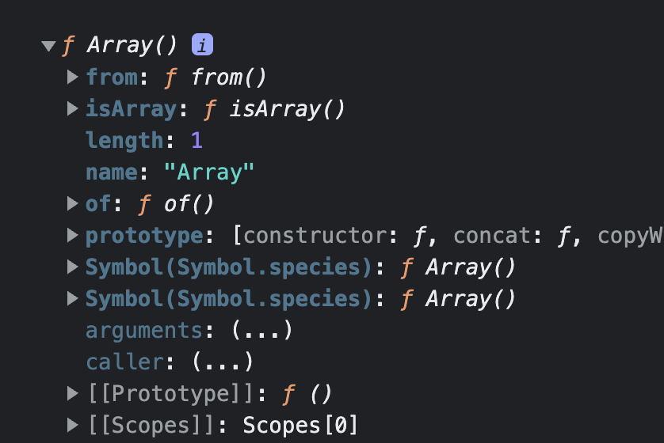

# Core-JS study

## Prototype

</br>

- 목차

1. Prototype  
   1-1. Prototype 의 기본 개념 용어와 예시  
   1-2. Prototype 실행 원리 정리  
   1-3. 인스턴스에서 prototype 에 접근하는 방법

</br>
</br>
</br>

## 1. Prototype

</br>
</br>
</br>

## 1-1. Prototype 의 기본 개념 용어와 예시

</br>
</br>
</br>


출처 - 인프런 코어자바스크립트

</br>

    Constructor 는 생성자

    그 오른쪽은 prototype

    그 아래는 instance

</br>

Constructor.prototype 과 instance[[Prototype]] 가 같은 객체를 바라본다는 뜻이다.

</br>

그런데 [[Prototype]] 는 접근 가능한 것이 아니라 정보를 보여주기만 할 뿐 (console 에서만 표시되는 내용, prototype 에 직접 접근 불가)으로,

</br>

실제 동작상으로는 instance 와 동일시 되어 생각하면 된다.

</br>


출처 - 인프런 코어자바스크립트

</br>
</br>

이를 설명하기 위해 배열의 예시를 가져온다.

</br>

[1, 2, 3] 이라는 요소를 가진 배열이 있다.

</br>

생성자로 생성한 경우 생성자 함수는 Array 가 된다.

</br>

Array 라고 하는 함수에는

    from()
    isArray()
    of()
    arguments
    length
    name
    prototype

등의 프로퍼티들이 있다.

</br>

크롬 개발자 도구에서 Array 생성자 함수를 호출하면 아래와 같다.



</br>

여기서 prototype 이라고 하는 프로퍼티가 있다.

</br>

이것이 [1, 2, 3] 배열 리터럴의 [[Prototype]] 으로 연결되어 있는 것이다.

</br>

prototype 이라고 하는 프로퍼티는 객체인데 이 객체에는 아래와 같은 프로퍼티들이 담겨 있다.


</br>

    concat()
    filter()
    forEach()
    map()
    push()
    pop()

등 배열 메서드들이 여기에 담겨 있다.

</br>
</br>

이번에는 배열 인스턴스를 출력해본다.

</br>


</br>

여기서 [[prototype]] 을 열어본다면 아래와 같이 메서드 리스트가 나온다.

</br>


</br>

위의 Array.prototype 과 내용이 같은 것을 확인할 수 있으며 같은 객체라는 것이 확인된다.

</br>

이 중 prototype 에 있는 constructor 라는 프로퍼티가 보이는데 여기에 Array() 함수가 담겨 있다.


</br>

Array.prototype.constructor 는 Array() 자기 자신 즉, Array 생성자 함수 자기 자신을 가리킨다.


</br>

배열.constructor 역시 Array 생성자 함수 자기 자신을 가리킨다.

</br>


</br>

    [1, 2, 3].constructor 로 접근하려고 하면

    [1, 2, 3].[[prototype]].constructor 요청과 동일하게 인식 (실제로 이런 방식으로 접근할 수 있는 것은 아님)

    이는 곧 Array.prototype.constructor 와 동일하다고 간주하게 됨

    그리고 이들은 결국 Array() 생성자 함수를 가리키게 됨

    => 결론적으로 내부적으로 이들이 모두 같음

</br>
</br>

한편 숫자 리터럴이 있다.

</br>

숫자 리터럴은 자체가 객체가 아니기 때문에 (기본형 데이터 타입) [[prototype]] 프로퍼티가 있을 수 없다.

</br>

그래도 개발자가 숫자 리터럴을 인스턴스인 것처럼 사용하려고 한다면 즉, 메서드(i.g - .toFixed())를 사용하려고 한다면

</br>

자바스크립트가 임시로 숫자 리터럴에 해당하는 Number 생성자 함수 인스턴스(Number.prototype)를 만든다.

</br>

그리고 해당 프로토타입에 있는 메서드를 적용해서 원하는 결과를 얻게 한다.

</br>

그 다음 다시 인스턴스를 제거하는 식으로 동작한다.

</br>

문자열 리터럴도 마찬가지이다.

</br>

기본형 데이터 타입은 모두 이 같은 방식으로 메서드를 호출할 수 있게 된다.

</br>

한편, 참조형 데이터 타입은 처음부터 인스턴스이기 때문에 기본형 데이터 타입처럼 메서드를 호출하는 순간 인스턴스를 임시 생성했다가 폐기하는 그런 과정을 거치지 않는다.

</br>

어쨌든 숫자든, 문자열이든, 함수든 할 것 없이 모두 아래와 같은 구조를 가지게 된다는 것이다.

</br>
</br>
</br>

## 1-2. Prototype 실행 원리 정리

</br>
</br>
</br>


출처 - 인프런 코어자바스크립트

</br>

Data 자신에게는 메서드가 없지만 생성자 함수의 prototype 프로퍼티에 있는 메서드를 [[prototype]] 이라는 연결 통로를 통하여 마치 자신의 것처럼 사용할 수 있다는 것이다.

</br>

null 과 undefined 를 제외한 모든 데이터 타입에는 이와 같은 생성자 함수가 존재한다.

</br>

또한 각 생성자함수 프로토타입에는 각 데이터 타입에만 해당하는 전용 메서드들이 정의되어 있다는 것이다.

</br>
</br>
</br>

## 1-3. 인스턴스에서 prototype 에 접근하는 방법

</br>
</br>
</br>

그렇다면 인스턴스에서 직접 prototype 에 접근할 수 있는 방법을 살펴본다.

</br>


출처 - 인프런 코어자바스크립트

</br>

    접근 방법 (2)

    1. instance.__proto__
      > console 에 보이지는 않지만 접근 가능
      > but, ES2015 에서 기존 브라우저에서 마음대로 제공하던 기능을 호환성 차원에서 문서화 해준 것이기 때문에
      가급적이면 공식적인 방법인 아래 2번 메서드를 사용하는 것이 나음

    2. Object.getPrototypeOf(instance)

</br>

예시는 아래와 같다.

</br>

```js
function Person(n, a) {
  this.name = n;
  this.age = a;
}

var sue = new Person("수", 100);

var sueClone1 = new sue.__proto__.constructor("수_클론1", 100);

var sueClone2 = new sue.constructor("수_클론2", 100);

var sueClone3 = new Object.getPrototypeOf(sue).constructor("수_클론3", 100);

var sueClone4 = new Person.prototype.constructor("수_클론4", 100);
```

    sue 와 sueClone1, 2, 3, 4 는 모두 Person 의 인스턴스가 됨

    모두 동일한 프로퍼티에 접근할 수 있음

    > sueClone1 - sue.__proto__ 에 의해 Person.prototype 에 접근 가능
    > sueClone2 - sue 의 [[prototype]] 프로퍼티에 의해서 Person.prototype 에 접근 가능
    > sueClone3 - Object.getPrototypeOf(instance) 메서드에 의해 Person.prototype 에 접근 가능
    > sueClone4 - Person.prototype 자체가 Person.prototype

    모두 Person.prototype 을 가리키고 있음

    
    정리

    a) instance.__prototype__
    b) instance
    c) Object.getPrototypeOf(instance)
    d) Constructor.prototype

    위의 4가지 방법에 의해 생성자 함수의 prototype 이라고 하는 프로퍼티에 접근 가능

    또한 동일한 함수 Person 이라고 하는 생성자 함수를 가리킴